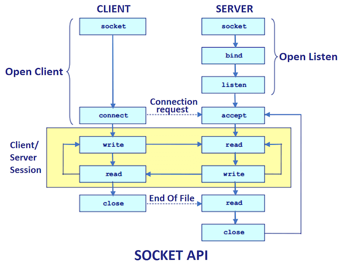

Socket Programming
==================

We want to use Java to set up a socket based network connection. In particular,
we want to write the code that runs in each processes on either end of a
network connection.

```text
                client_host                                              server_host
+-------------------------------------------+                 +---------------------------------+
|              client_process               |                 |               server_process    |
|              +-----------+                |                 |               +-----------+     |
|              |           |                |                 |               |           |     |
| keyboard >-->> 0       1 >>--+--> console |                 |           >-->> 0       1 >>--> |
|              |           |   |            |                 |               |           |     |
|              |         2 >>--+            |                 |               |         2 >>--> |
|              |           |       socket   |                 |   socket      |           |     |
|              |           |      +------+  |                 |  +------+     |           |     |
|              |         3 >>---->>      |  |   tcp network   |  |      <<---<< 3         |     |
|              |           |      |      O=======================O      |     |           |     |
|              |         4 <<----<<      |  |   connection    |  |      >>--->> 4         |     |
|              |           |      +------+  |                 |  +------+     |           |     |
|              +-----------+                |                 |               +-----------+     |
+-------------------------------------------+                 +---------------------------------+
```


All the example code mentioned in this document is in the following zip file.

* <http://cs.pnw.edu/~rlkraft/cs33600/for-class/simple_client-server_pairs.zip>

## Client/Server sockets

In the above picture, the relationship between the two hosts is not symmetric.
Each host plays a particular role in the network connection. One host is the
**server** and the other host is the **client**.

What makes a host a "server" is the kind of socket that it creates. Java has
two classes that represent sockets, a `ServerSocket` class and a `Socket`
class.

<ul>
<li><a href="https://docs.oracle.com/en/java/javase/21/docs/api/java.base/java/net/ServerSocket.html">java.net.ServerSocket</a></li>
<li><a href="https://docs.oracle.com/en/java/javase/21/docs/api/java.base/java/net/Socket.html">java.net.Socket</a></li>
</ul>

A server process needs to be ready to accept a client connection at any time.
A server process needs a kind of socket that is always "open" and ready to
answer a client's connection request. Java's `ServerSocket` objects play this
socket role.

A `ServerSocket` should not be responsible for communicating with a client.
This is not an obvious fact. We would think that communicating with the
client would be the main responsibility of a `ServerSocket`. But if a
`ServerSocket` is busy handling communication back and forth with a client,
then the `ServerSocket` will not be ready to answer a connection request from
a new client. So a `ServerSocket` does not handle client communication. We
will see below that a `ServerSocket` passes off the responsibility of
communicating with a client to a regular `Socket` object.

A `ServerSocket` object has the responsibility of creating connections to
clients but not communicating with them. A `Socket` object has the
responsibility of communicating with another `Socket` object.


## Network connection

In networking jargon, a "connection" (or "tcp connection") is thought of
like this

```text
                           a tcp connection
        IP address O==============================O IP address
        Port number                                 Port number
```

A **connection** is a pair of endpoints and each **endpoint** is an `ip:port`
address pair. So a connection is a pair of pairs, `(ip:port, ip:port)`.

At each endpoint of a connection there is a socket. The socket's `ip:port`
pair is called the "socket address".

```text
        socket                                         socket
    +-------------+                                +-------------+
    |             |        a tcp connection        |             |
    | IP address  O================================O IP address  |
    | Port number |                                | Port number |
    |             |                                |             |
    |             |                                |             |
    +-------------+                                +-------------+
```

Each socket is **bound** to the port number on its end of the connection
and is **connected** to the socket on the other end of the connection.


Know these terms:

* connection
* endpoint
* socket address
* bind
* connect

Since a client must know both the IP address and the port number for any server process that it wants to communicate with, the server's port number

On the other hand, the port number that the client uses at its endpoint in the tcp connection does not need to be


## bind, listen, accept, connect

In this section we will describe the steps used by a server process and
a client proce3ss to establish a tcp connection and then communicate
with each other over the connection.

The steps below are based on the C language version of the "sockets interface".
Sockets were first invented for the C language, so that is the original
Socket API. The Java Socket API combines a few of these steps, but when
something goes wrong, the JVM's error messages often refer to these C
steps by their C function names.

Also, sockets are part of every modern operating system and the Socket API
has an implementation in almost every modern programming language. A Java
client running on a Windows host might be communicating with a C server or
a JavaScript server running on a Linux host. So the steps below are really
a language neutral sequence that reflects what is happening in the operating
system.

If you look at the programs "EchoServer_v1.java" and "EchoClient_v1a.java"
(from the
[simple_client-server_pairs.zip](http://cs.pnw.edu/~rlkraft/cs33600/for-class/simple_client-server_pairs.zip) file)
you can see these steps implemented in Java code. The Java code has comments
that label the code according to which steps the code is implementing.


Step 1) The server process creates an unbound `ServerSocket`.  This
        `ServerSocket` is not yet able to establish connections with
        clients.

```text
                                                    ServerSocket
                                                   +-------------+
                                                   |             |
                                                  O| IP address  |
                                                   |             |
                                                   |             |
                                                   |             |
                                                   +-------------+
```

Step 2) The server process binds its `ServerSocket` to a port number.
        This `ServerSocket` is not yet able to establish connections
        with clients.

```text
                                                    ServerSocket
                                                   +-------------+
                                                   |             |
                                                  O| IP address  |
                                                   | Port number |
                                                   |             |
                                                   |             |
                                                   +-------------+
```

Step 3) The server process puts its `ServerSocket` in a "listening" state.
        The `ServerSocket` can now establish connections with clients but
        the clients can not yet communicate with the server process. Any
        clients that connect at this stage are put into a "backlog" queue.

Step 4) The server process calls the `accept()` method on its `ServerSocket`.
        The server process blocks until there is a connected client. The
        `ServerSocket` is now in a state where it can communicate with a
        connected client.


Step 5) A client process creates an unconnected `Socket`.

```text
        Socket                                      ServerSocket
    +-------------+                                +-------------+
    |             |                                |             |
    | IP address  |O                              O| IP address  |
    |             |                                | Port number |
    |             |                                |             |
    |             |                                |             |
    +-------------+                                +-------------+
```

Step 6) The client process asks its `Socket` to connect to the server's
       `ServerSocket`. The client socket is bound to an "ephemeral"
        port number. (This picture would be just  before the server's
       `accept()` method returns.)

```text
        Socket                                      ServerSocket
    +-------------+                                +-------------+
    |             |       tcp connection           |             |
    | IP address  O================================O IP address  |
    | Port number |                                | Port number |
    |             |                                |             |
    |             |                                |             |
    +-------------+                                +-------------+
```

 Step 7) After the connection is established and `accept()` returns,
         the `ServerSocket` will have created a new communicating
         `Socket` and connected the client `Socket` to this new `Socket`.
         (This picture would be just after the server's `accept()`
         method returns.)

```text
        Socket                                      ServerSocket
    +-------------+                                +-------------+
    |             |       tcp connection           |             |
    | IP address  O======================+        O| IP address  |
    | Port number |                      |         | Port number |
    |             |                      |         |             |
    |             |                      |         |             |
    +-------------+                      |         +-------------+
                                         |
                                         |             Socket
                                         |         +-------------+
                                         |         |             |
                                         +=========O IP address  |
                                                   | Port number |
                                                   |             |
                                                   |             |
                                                   +-------------+
```

Step 7a) If the server process is parallelized, then the server
         can once again call `accept()` on the `ServerSocket` and
         establish a simultaneous communicating connection with
         a second client. If the server process is not parallelized,
         then the `ServerSocket` cannot establish a communicating
         connection with another client while the server process
         is communicating with the current client. However, the
         `ServerSocket` can queue up (non-communicating) connections
         with new clients! (See Step 8a below.)


Step 8) The client and server processes get input and output streams
        from their communicating `Socket` objects.

```text
        Socket                                      ServerSocket
    +-------------+                                +-------------+
    |             |       tcp connection           |             |
    | IP address  O======================+        O| IP address  |
    | Port number |                      |         | Port number |
    |             |                      |         |             |
    |             |                      |         |             |
    +-/|\-----\ /-+                      |         +-------------+
       |       |                         |
       |       |                         |             Socket
       |       |                         |         +-------------+
    output   input                       |         |             |
    stream   stream                      +=========O IP address  |
                                                   | Port number |
                                                   |             |
                                                   |             |
                                                   +-/|\-----\ /-+
                                                      |       |
                                                      |       |
                                                      |       |
                                                   output   input
                                                   stream   stream
```

Step 8a) In the case where the server is not parallelized and
         can only handle one communicating connection at a time,
         if a second client establishes a connection with the
         server, then that second client can get input and output
         streams from its `Socket` object while that `Socket` is
         still connected to the server's `ServerSocket`. But the
         client `Socket` cannot communicate with the `ServerSocket`.
         If the client tries to read from its input stream or
         write to its output stream, then the client will block
         until the server process returns from the `accept()` method
         and creates a communicating `Socket`. In other words, the
         client's `Socket` can move from Step 6 to Step 8 while
         the server's `ServerSocket` is stuck at Step 6.

```text
        Socket                                      ServerSocket
    +-------------+                                +-------------+
    |             |       tcp connection           |             |
    | IP address  O================================O IP address  |
    | Port number |                                | Port number |
    |             |                                |             |
    |             |                                |             |
    +-/|\-----\ /-+                                +-------------+
       |       |
       |       |
       |       |
    output    input
    stream    stream
```

Step 9) The client and server processes implement an application
        layer protocol using the tcp connection and its associated
        streams. A Java client or server process will wrap the
        input and output byte stream with whatever higher level
        stream is appropriate for the agreed on protocol (a text
        protocol or a binary protocol, etc.).


Step 10) At some point, either the client or the server process closes
         its end of the tcp connection by calling the `close()` method
         on its `Socket`. When the other endpoint detects this, the other
         endpoint closes its end of the connection by calling `close()`
         on its `Socket`.
         (NOTE: Calling `close()` on a `Socket` is not the same as
                calling `close()` on the socket's two streams.)

```text
        Socket                                      ServerSocket
    +-------------+                                +-------------+
    |             |                                |             |
    | IP address  |O                              O| IP address  |
    | Port number |                                | Port number |
    |             |                                |             |
    |             |                                |             |
    +-/|\-----\ /-+                                +-------------+
       |       |
       |       |                                       Socket
       |       |                                   +-------------+
     output   input                                |             |
     stream   stream                              O| IP address  |
                                                   | Port number |
                                                   |             |
                                                   |             |
                                                   +-/|\-----\ /-+
                                                      |       |
                                                      |       |
                                                      |       |
                                                    output   input
                                                    stream   stream
```

Step 11) The two unused `Socket` objects get garbage collected.

```text
                                                    ServerSocket
                                                   +-------------+
                                                   |             |
                                                  O| IP address  |
                                                   | Port number |
                                                   |             |
                                                   |             |
                                                   +-------------+
```

Step 12) If the server process wants to serve another client, then the server
         process should once again call `accept()` on its `ServerSocket` and
         be ready to establish a new communicating connection with a client
         (that is, go to Step 4). However, if the server process no longer
         wants to serve clients, then the server process should call the
         `close()` method on its `ServerSocket` and free up the port it
         is bound to.


Here are illustrations that summarize the above steps.

<ul>
<li><a href="../Socket_API.png">Socket_API</a></li>
<li><a href="https://www.cs.dartmouth.edu/~campbell/cs50/TCPsockets.jpg">sequence of function calls for a client/server connection</a></li>
</ul>


## Using JShell

In JShell, we can create a local `Socket` object and connect it to a remote
server process, but there is not a lot that we can do with the `Socket` in
just a few lines of code. The following code gets some basic information
from the `Socket` object and then sends the remote server process a simple
message and waits for a reply.

```java
var socket = new Socket("www.pnw.edu", 80) // Steps 5, 6, 7.
socket.isConnected()
socket.getRemoteSocketAddress()
socket.getInetAddress()
socket.getPort()
socket.getLocalSocketAddress()
socket.getLocalAddress()
socket.getLocalPort()

socket.getOutputStream().write( "GET / HTTP/1.0\r\n\r\n".getBytes() ) // Steps 8, 9.
var bytes = socket.getInputStream().readAllBytes()  // Steps 8, 9.
new String(bytes)
socket.close()  // Step 10.
socket = null   // Step 11.
```

Here are a few more client interactions with a remote server process.

```java
var socket = new Socket("google.com", 80)       // Steps 5, 6, 7.
var out = socket.getOutputStream()              // Step 8.
var in  = socket.getInputStream()               // Step 8.
out.write("GET / HTTP/1.0\r\n\r\n".getBytes())  // Step 9.
var inBytes =  in.readAllBytes()                // Step 9.
new String(inBytes)
socket.close()                                  // Step 10.
socket = null                                   // Step 11.
```

```java
var socket = new Socket("microsoft.com", 80)    // Steps 5, 6, 7.
var out = socket.getOutputStream()              // Step 8.
var in  = socket.getInputStream()               // Step 8.
out.write("GET / HTTP/1.0\r\n\r\n".getBytes())  // Step 9.
var inBytes =  in.readAllBytes()                // Step 9.
new String(inBytes)
socket.close()                                  // Step 10.
socket = null                                   // Step 11.
```

```java
var socket = new Socket("norvig.com", 80)
var out = socket.getOutputStream()
var in  = socket.getInputStream()
out.write("GET /big.txt HTTP/1.1\r\nHost: norvig.com\r\n\r\n".getBytes())
var bytes = socket.getInputStream().readAllBytes() // 6MB, takes some time to download
var msg = new String(bytes)
msg.length()
socket.close()
System.out.print(msg) // very long
```

We can set up a client/server pair in JShell if we use two JShell sessions.
Open a terminal window and start JShell. In JShell enter this server code.
It's better if you type these lines of code one at a time, so that you can
see when the server blocks and how the server reacts to the client.

```java
var serverSocket = new ServerSocket(5000)     // Steps 1, 2, 3.
var socket = serverSocket.accept()            // Steps 4, 7.
var out = socket.getOutputStream()            // Step 8.
var in  = socket.getInputStream()             // Step 8.
var bytesIn = in.readAllBytes()               // Step 9.
var str = new String(bytesIn)
var bytesOut = ("[[" + str + "]]").getBytes()
out.write(bytesOut)                           // Step 9 (echo).
socket.shutdownOutput()                       // Step 9.
socket.close()                                // Step 10.
socket = null                                 // Step 11.
serverSocket.close()                          // Step 12.
serverSocket = null
```

Open a second terminal window and start JShell. In JShell enter this client
code. It's better if you type these lines of code one at a time, so that you
can see when the client blocks and how the client reacts to the server. For
example, since the server uses the method `readAllBytes()`, the server will
not return from that method until the client sets the end-of-file condition
by calling the `shutdownOutput()` method on its socket. And since the client
also uses the `readAllBytes()` method, it will not return from that method
until the server sets the end-of-file condition on its output stream.

```java
var hostname = "localhost"
var address = InetAddress.getByName(hostname)
var portNumber = 5000
var socket = new Socket(address, portNumber)         // Steps 5, 6, 7.
var out = socket.getOutputStream()                   // Step 8.
var in  = socket.getInputStream()                    // Step 8.
var bytesOut = "This is from the client.".getBytes()
out.write(bytesOut)                                  // Step 9.
socket.shutdownOutput()                              // Step 9.
var bytesIn = in.readAllBytes()                      // Step 9 (receive the echo).
new String(bytesIn)
socket.close()                                       // Step 10
socket = null;                                       // Step 11.
```


## Application layer protocol

Once the tcp connection has been made between the client and the server, the
two processes need to start communicating with each other (Step 8 above). The
manner in which they communicate is called the **application layer protocol**.

<ul>
<li><a href="https://en.wikipedia.org/wiki/Application_layer">Application layer</a></li>
<li><a href="https://resources.saylor.org/wwwresources/archived/site/wp-content/uploads/2012/02/Computer-Networking-Principles-Bonaventure-1-30-31-OTC1.pdf#page=31">Chapter 3, The application Layer</a> from "<a href="https://open.umn.edu/opentextbooks/textbooks/computer-networking-principles-protocols-and-practice">Computer Networking: Principles, Protocols and Practice</a>"</li>
</ul>

In the following picture, the "application layer protocol" is represented
by the yellow box. That box represents the client and the server sending
messages back and forth.



Every client/server pair must have a "protocol" that they agree to use. For
example, it must be agreed on, ahead of time, which process communicates
first on their connection. Should the client's first step be to send a
message while the server's first step is to wait to receive a message, or
the other way around? If the first step of both the client and the server
is waiting to receive a message, then the two processes will deadlock (why?).
So it's important to establish a rule about who writes and who reads first.

The client and server need to agree on how many turns of reading and writing
each process will take. They need to agree on how they will determine when to
terminate their connection. They need to agree on the format of the data that
they transmit. For example, if they agree to send text data, then they also
need to agree on a character encoding (UTF-8, ASCII, etc.). If they agree
to send binary numeric data, then they might need to agree whether decimal
numbers will be sent as floats or doubles and also what byte order to use.


The folder
[simple_client-server_pairs.zip](http://cs.pnw.edu/~rlkraft/cs33600/for-class/simple_client-server_pairs.zip)
contains six pairs of client/server programs that use sockets to communicate
with each other.

Each client/server pair implements a different (but simple) application
layer protocol. Each client/server pair documents its protocol in the
Javadoc comment at the beginning of each source file. You can use the
"build_Javadocs.cmd" script file to create the Javadocs folder and then
read the documentation in a convenient way.

For each client/server pair, compile both the client and the server program,
start the server program in one command-line terminal window, and then start
the client in another command-line terminal window.

For example, try the first client/server pair. Open a terminal window in the
"simple_client-server_pairs" folder and compile the programs "EchoServer_v1.java"
and "EchoClient_v1b.java".

```text
    simple_client-server_pairs> javac EchoServer_v1.java
    simple_client-server_pairs> javac EchoClient_v1b.java
```

In one command-line terminal window, run "EchoServer_v1".

```text
    simple_client-server_pairs> javac EchoServer_v1
```

Notice how the server process logs to the terminal window basic information
about itself.

In a second command-line terminal window run "EchoClient_v1b".

```text
    simple_client-server_pairs> java EchoClient_v1b
```

Notice that the client process also logs basic information about itself, and
the server process logs information about the client. At the prompt, type a
message to send to the server. Notice that both the server and the client
log information about the exchange of messages.

Each of the servers is programmed to accept an arbitrary number of connections
from clients. After you launch a client and it communicates with the server,
launch another client, then another client. Notice that the server logs to its
console window a count of each client connection.


Here are descriptions of the protocols implemented by the client/server pairs.

The first client/server pair,
```text
   EchoServer_v1.java
   EchoClient_v1a.java
   EchoClient_v1b.java
```
implements a very simple protocol. The client communicates first and sends
one line of text to the server and then waits for a response from the server.
The server receives the client's line of text, echoes it back to the client,
and then closes its end of the connection. The client receives the response
from the server and then closes its end of the connection. The client
"EchoClient_v1a.java" has the string that it sends to the server built into
the client code. The client "EchoClient_v1b.java" prompts the user for the
line of text to send to the server. The client prompts the user *after* it
has made its connection to the server. This lets the client "block" the
server and lets us do some interesting experiments (see below).

The second client/server pair,
```text
   EchoServer_v2.java
   EchoClient_v2.java
```
implements a protocol similar to the first pair but it echoes two lines
of text. The client communicates first and sends one line of text to the
server and then waits for a response from the server. The server receives
the client's first line of text, echoes it back to the client, and then
waits for a second line of text from the client. The client receives the
first response from the server, sends the server a second line of text,
and then waits for the second response from the server. The server receives
the client's second line of text, echoes it back to the client, and then
closes its end of the connection. The client receives the second response
from the server and then closes its end of the connection.

The third client/server pair,
```text
   EchoServer_v3.java
   EchoClient_v3.java
```
implements a protocol similar to the second pair but the client can send
an arbitrary number of text lines to the server. The client tells the server
that it is done sending text by closing its output stream to the socket (but
not yet closing the connection), and then waits for a final, summary message
from the server. The server immediately echoes back to the client each line
of text sent by the client. When the server detects the end-of-stream
condition on its input stream from the socket. the server sends one last
summary message to the client and then the server closes its end of the
connection. After the client receives the last summary message, it closes
its end of the connection.

The fourth client/server pair,
```text
   NumericServer.java
   NumericClient.java
```
implements a binary protocol. The client communicates first and sends to the
server a 4-byte binary `int` value and then the client waits for the server
to send it the number of `double` values represented by that integer value.
The server receives the `int` value from the client and then sends to the
client that many 8-byte binary `double` values. After sending the doubles
to the client, the server closes its end of the connection. After the client
receives the appropriate number of doubles from the serve, the client closes
its end of the connection. Both the `int` and the `double` values are sent in
the big endian byte order, which is the default byte order for the Internet.

The fifth client/server pair,
```text
   NumericTextServer.java
   NumericTextClient.java
```
implements a text version of the previous protocol. The client communicates
first and sends to the server an integer encoded as a text string and then
the client waits for the server to send it the number of doubles represented
by that integer value. The server receives the integer value from the client
and then sends to the client that many doubles encoded as text strings. After
sending the doubles to the client, the server closes its end of the connection.
After the client receives the appropriate number of doubles from the serve, the
client closes its end of the connection. The client and server need to agree on
what text encoding to use on each of the two connection streams. They do not
have to use the same encoding on both streams, but they do need to agree on
what encoding is used on each stream. The client sends an ASCII encoded
integer to the server. The server sends UTF-16BE encoded doubles to the
client. Also, since the numbers are sent as encoded text, and every number
can have a different number of digits, the server need to use white space
characters to separate the double values from each other.

The sixth client/server pair,
```text
   UploadServer.java
   UploadClient.java
```
implements a binary protocol. The client sends to the server all the data
from the client's standard input stream. The server stores the data it
receives from a client in a file in the server's current directory. The
communication is a binary protocol because the server does not know, and
does not need to know, what kind of data is being sent to it by the client.
The client may upload a text file or a binary file to the server. The server
must use a binary input stream from the client and a binary output stream to
the local saved file.


## Experiments

Here are several experiments that you can do using the client/server programs
from the folder
[simple_client-server_pairs.zip](http://cs.pnw.edu/~rlkraft/cs33600/for-class/simple_client-server_pairs.zip).

**Experiment 1:**
Start up "EchoServer_v1.java" and then run "EchoClient_v1b.java" but do not
yet type in any input text. Then run an instance of "EchoClient_v1a.java"
and then run another instance of "EchoClient_v1b.java" (you will need four
command-line terminal windows). Then type a line of input to the first
instance of "EchoClient_v1b.java". What happens? Why?


**Experiment 2:**
Start up "EchoServer_v2.java" and then run "EchoClient_v1a.java". Then run
another instance of "EchoClient_v1a.java". What happens? Why?


**Experiment 3:**
Start up "EchoServer_v3.java" and then run "EchoClient_v1a.java". Then run
another instance of "EchoClient_v1a.java". Then run an instance of
"EchoClient_v2.java". What happens? Why?


**Experiment 4:**
Start up "EchoServer_v1.java" and then run "EchoClient_v3.java". What happens?
Why?


**Experiment 5:**
Start up "EchoServer_v3.java" and then type in the following URL into your
browser's address bar.
```text
     localhost:5000
```
What happens? This experiment works a bit better if you stop the server
from echoing lines back to the client. You need to comment out two lines
of code in the server and then recompile it.


**Experiment 6:**
Start up "NumericServer.java" and then run "EchoClient_v1b.java". Enter two
characters at the prompt, say "xy", and tap the Enter key. What happens?
Why?

Still using "NumericServer.java", run "EchoClient_v2.java". Tap the Enter
key at the first prompt. What happens? Why? Tap the Enter key again at the
second prompt. What happens? Why? (Hint: Where does the number `538978406`
come from?)


**Experiment 7:**
Start up "EchoServer_v3.java" and then run "UploadClient.java" (without any
file redirection). Type a bunch of input lines followed by ctrl-z. Why
doesn't the server respond to each of the client's input lines? Why do all of
the server's responses come after the client closes its input to the server?


**Experiment 8:**
Try running two instances of a server on the same port number. What happens?
Try running two instances of a server on two different port numbers (pass the
port number as a command-line argument). Run clients that connect to either
running server (give the clients command-line arguments to tell them which
running server to connect to).


**Experiment 9:**
In the program "EchoServer_v3.java", change the constructor call for `ServerSocket`
from
```java
    serverSocket = new ServerSocket(portNumber);
```
to
```java
    serverSocket = new ServerSocket(portNumber, 4); // Set the value of backlog.
```
This sets the `backlog` of the `ServerSocket` to 4. Recompile the program, and
run the server. In a second terminal window, compile and run "EchoClient_v1b.java".
Do not type a line of text for the client; let the client block the server. In
another terminal window, run a second instance of "EchoClient_v1b.java". In
another terminal window, run a third instance of "EchoClient_v1b.java". In
another terminal window, run a fourth instance of "EchoClient_v1b.java". In
another terminal window, run a fifth instance of "EchoClient_v1b.java". What
happens? See the Javadoc for the `ServerSocket` constructor with the `backlog`
parameter.

<ul>
<li><a href="https://docs.oracle.com/en/java/javase/21/docs/api/java.base/java/net/ServerSocket.html#%3Cinit%3E(int,int)">java.net.ServerSocket(int port, int backlog)</a></li>
</ul>
* <>


**Experiment 10:**
Try running a server and its client on two different computers at the same
time, so you are really using a network.


**Experiment 11:**
Use the command-line program "netstat" to get information about server and
client programs that are currently running on your computer.

```text
  > netstat -n -p tcp
  > netstat -f -p tcp
  > netstat /?
```

* <https://learn.microsoft.com/en-us/windows-server/administration/windows-commands/netstat>
* <https://man7.org/linux/man-pages/man8/netstat.8.html>


**Experiment 12:**
In a PowerShell terminal window, use the "Get-NetTCPConnection" command to
get information similar to "netstat" about running server and client programs.

```text
    PS > Get-NetTCPConnection
```

* <https://learn.microsoft.com/en-us/powershell/module/nettcpip/get-nettcpconnection>


**Experiment 13:**
Download and run the Windows GUI program "TCPView" to get information similar to
"netstat" and "Get-NetTCPConnection".

* <https://learn.microsoft.com/en-us/sysinternals/downloads/tcpview>


**Experiment 14:**
How do "netstat", "Get-NetTCPConnection", and "TCPView" distinguish between
a communicating network connection and a network connection that is stuck in
the "backlog" queue of a `ServerSocket`?


## The end-of-message problem

When a client and a server implement an application layer protocol (the yellow
box in this [Socket_API](../Socket_API.png) diagram), they enter a cycle where
the client sends the server a "request message" and the server sends back to
the client a "response message".

When the client process sends a request message, and the client reaches the
end of that message, the client needs a way to tell the server that there is
no more data and the server should switch from reading data from the client
to writing its response message back to the client. Without some kind of
signal from the client that the request message is complete, the server has
no way to know if a pause in the client's data transmission means the end of
a message (and the client is waiting for a response) or if a pause really is
just a pause and the client's data transmission will continue.

When the server sends its response message back to the client, the server
has a similar problem. It needs a way to signal the client that the server
has finished sending a complete response message.

The client also needs a way to signal to the server that it wants to exit
the request/response cycle and close the connection (or, it may be the server
that wants to signal its intention to end the cycle and close the connection).

The problem is that pauses in data transmission are common in networks.
A pause could be caused by a large surge in network traffic, or it could
be caused by a temporary failure somewhere in the network, or it could be
caused by the other end of the connection needing to do a long calculation.
An endpoint of a network connection that is reading data can never be sure
when a pause in data transmission means that the other end has stopped
sending data and is waiting for a reply, or if the data transmission will
soon resume.

One solution to this problem is to define, as part of the application layer
protocol, a specific length for the request and response messages. For example
each message may be defined to be a specific number of bytes, or to be exactly
one line of text. In this case, when the server has read the specified number
of bytes (or one line of text) from the client, the server knows that it has
read the whole request message and the server can switch to sending the
response message. If the server has not yet read the correct number of bytes
and there is a (long) pause in the data transmission, then the server just
waits, since it knows that there should be more data arriving.

Similarly, an application layer protocol can specify an exact number of
request/response cycles between the client and server.

The problem with this strategy is that it does not allow for arbitrarily
sized requests or responses or an arbitrary number of request/response
cycles. In most application layer protocols, the length of every message
cannot be known in advance.

Similarly, the number of requests made by every client cannot always be
known in advance

An application layer protocol needs a strategy that allows the client and
the server to send an arbitrary amount of data in a message and for the
recipient to be able to know when it has received all of the (arbitrary)
data in a message.

Similarly, the protocol needs a strategy that allows either the client or
the server to signal when it wants to end the request/response cycle.

In general, there are three ways in which a client/server pair can send
messages of arbitrary size and still coordinate the exchange of their
read/write roles. They can coordinate by,

1.  using end-of-stream,
2.  using a counter,
3.  using a sentinel value.

Each of these three strategies can also be used to signal the end of the
request/response cycle.

Let's consider a specific example of a client/server pair that needs to solve
the "end-of-message" problem.

Suppose we have a client that wants to send to the server sequences of integer
values and have the server send back the sum of each sequence. We will create
an application layer protocol in which each request message from the client to
the server is one sequence of integer values. The server's response message
will be a single integer value that is the sum of the sequence.

As part of the protocol, we need to specify a data format for the request and
response messages. Let us have all the integer values encoded as ASCII strings
of decimal digits with each integer value followed by a space character.

Also, let the client signal that there are no more request messages by closing
its end of the connection.

We still need to specify how the server, while it is reading integer values,
can know when it has received the last value in a sequence.

This leads us to three versions of our application layer protocol.

In the first version, we will specify that the client should close its
connection to the server right after the client sends the last value in
a sequence. Since the client is closing its connection to the server, the
client can only send one request message (one sequence) to the server.

In the second version of our protocol, we will specify that the client should
send, at the beginning of each sequence, the number of values in the sequence.
The server will receive this count value first, and then count that many
values, and then know it has received a complete request message.

In the third version of our protocol, we will specify that the client should
send a negative value at the end of each sequence. When the server reads a
negative value, it knows that the current sequence is complete. Since the
sentinel value is a negative number, none of the data values in a sequence
can be negative, so this strategy only allows the client to send sequences
of positive integers.

The second and third strategies allow the client to send as many sequences
(request messages) as it wants.

In all three protocols, the client sends the server a "stream" of integer
values separated by spaces. In the second and third protocols, the server
can always parse this stream into distinct messages and send a response at
the end of each message. For example, below there is a stream of integer
values for each of the second and third protocols. Each stream is made up
of five messages. For each stream, parse it to find the five messages and
determine what the server's response would be for each request message.

```text
    4 5 3 -6 7 3 8 -3 12 0 4 -5 0 3 2 5 11 12 13 14 15

    4 1 0 3 15 4 -1 4 12 9 32 -1 -1 12 8 3 0 1 -1 0 -1
```

The "end-of-message" sub folder of
[simple_client-server_pairs.zip](http://cs.pnw.edu/~rlkraft/cs33600/for-class/simple_client-server_pairs.zip)
contains three pairs of client/server programs that demonstrate these three
protocols.

The three client/server pairs in that folder,

1.  AdditionClient_v1.java  /  AdditionServer_v1.java
2.  AdditionClient_v2.java  /  AdditionServer_v2.java
3.  AdditionClient_v3.java  /  AdditionServer_v3.java

use, respectively,

1.  end-of-stream,
2.  a counter,
3.  a sentinel value.

The first client/server pair uses end-of-stream to denote that the client
is done writing its request message and so the server should stop reading
integers and send its response. Since the client uses end-of-stream to denote
it is done writing (that is, the client closes its output stream to the
server), the client can only send one request to the server.

In the second client/server pair, the client begins each request with a count
value to let the server know how many integers are in the request. When the
server has read than many integers, the server switches over to writing its
response. Since the client has not closed its output stream to the server,
the client can send any number of requests. The client uses end-of-stream
(that is, it closes its output stream) to denote the end of its requests
to the server.

In the third client/server pair, the client uses a negative number at the end
of each request message as a sentinel value to let the server know that it has
read the last value in the request. When the server reads a negative value it
should switch from reading integers to writing its response. Since the client
is using a negative number as a sentinel, it cannot use negative numbers as
data values. Since the client has not closed its output stream, the client
can send any number of requests to the server. The client uses end-of-stream
to denote the end of its requests to the server.


Let us look at JShell implementations of the second and third client/server
protocol.

Here is the server and the client for the second protocol that uses counter
values. You can copy and past this code into a JShell session.

```java
var clientCounter = 0
try (var serverSocket = new ServerSocket(5000)) { // Steps 1, 2.
   System.out.println("SERVER online:");
   while (true) {
      try (var socket = serverSocket.accept();                    // Steps 3, 6.
           var in = new Scanner(socket.getInputStream());         // Step 8 and 7.
           var out = new PrintWriter(socket.getOutputStream())) { // Step 8 and 7.
         ++clientCounter;
         var clientIP = socket.getInetAddress();
         var clientPort = socket.getPort();
         System.out.println("SERVER: Client " + clientCounter
                          + ": IP: " +  clientIP.getHostAddress()
                          + ", Port: " + clientPort);
         // Step 9. Read each sequence of integers, sum them, send back the sum.
         while (in.hasNextInt()) {
            var length = in.nextInt();
            System.out.println("SERVER: Client " + clientCounter
                             + ": Expecting sequence of length " + length + ".");
            System.out.print("SERVER: Client " + clientCounter + ": Sequence is: ");
            var sum = 0;
            for (int i = 0; i < length && in.hasNextInt(); ++i) {
               var n = in.nextInt();
               sum += n;
               System.out.print(n + " "); // Log the sequence.
            }
            System.out.println("\nSERVER: Client " + clientCounter + ": Message received: sum = " + sum);
            out.println(sum);
            out.flush();
         }
      } // Step 10.
      System.out.println("SERVER: Client " + clientCounter + ": Closed socket.");
   }
} // Step 12.
```

Here is the client for the above server. Start a second JShell session and
copy and paste this code into it. This code will connect to the server and
then expect you to type into the console the data values that this client
should send to the server. When you are done typing values, use Ctrl-D to
send the end-of-file signal to this client. NOTE: Even on Windows, you use
Ctrl-D to denote eof in JShell!

```java
var remoteHost = "localhost"
var remotePort = 5000
var ipAddress = InetAddress.getByName(remoteHost);
System.out.println("CLIENT: Connecting to server: " + remoteHost
                 + " on port " + remotePort );
try (var socket = new Socket(ipAddress, remotePort);        // Steps 5, 6, 7.
     var in = new Scanner(socket.getInputStream());         // Step 9 and 8.
     var out = new PrintWriter(socket.getOutputStream())) { // Step 9 and 8.
   System.out.println("CLIENT: Connected to server.");
   var localPort = socket.getLocalPort();
   System.out.println("CLIENT: Local Port: " + localPort);
   // Step 9. Send the server multiple integer sequences.
   var stdin = new Scanner(System.in);
   while (stdin.hasNextInt()) {
      var length = stdin.nextInt();
      out.print(length + " ");
      out.flush();
      String request = length + " ";  // For logging the request.
      for (int i = 0; i < length; ++i) {
         var n = stdin.nextInt();
         out.print(n + " ");
         out.flush();
         request += n + " ";  // For logging the request.
      }
      System.out.println("CLIENT: Request is: " + request);
      System.out.println("CLIENT: Request sent to the server.");
      var response = in.nextInt();
      System.out.println("CLIENT: Server response is: sum = " + response);
   }
} // Step 10.
```

Here is the server and the client for the third protocol that uses
sentinel values. Copy and paste this code into a new JShell session
to start this server.

```java
var clientCounter = 0
try (var serverSocket = new ServerSocket(5000)) { // Steps 1, 2.
   System.out.println("SERVER online:");
   while (true) {
      try (var socket = serverSocket.accept();                    // Steps 4, 7.
           var in = new Scanner(socket.getInputStream());         // Step 9 and 8.
           var out = new PrintWriter(socket.getOutputStream())) { // Step 9 and 8.
         ++clientCounter;
         var clientIP = socket.getInetAddress();
         var clientPort = socket.getPort();
         System.out.println("SERVER: Client " + clientCounter
                          + ": IP: " +  clientIP.getHostAddress()
                          + ", Port: " + clientPort);
         // Step 8. Read each sequence of integers, sum them, send back the sum.
         while (in.hasNextInt()) {
            System.out.print("SERVER: Client " + clientCounter + ": Sequence is: ");
            var sum = 0;
            var n = -1;
            while (in.hasNextInt() && (n = in.nextInt()) > 0 ) {
               sum += n;
               System.out.print(n + " "); // Log the sequence.
            }
            System.out.println("\nSERVER: Client " + clientCounter + ": Message received: sum = " + sum);
            out.println(sum);
            out.flush();
         }
      } // Step 10.
      System.out.println("SERVER: Client " + clientCounter + ": Closed socket.");
   }
} // Step 12.
```

Here is the client for the above server. Start another JShell session and
copy and paste this code into it. This code will connect to the server and
then expect you to type into the console the data values that this client
should send to the server. When you are done typing values, use Ctrl-D to
send the end-of-file signal to this client. NOTE: Even on Windows, you use
Ctrl-D to denote eof in JShell!

```java
var remoteHost = "localhost"
var remotePort = 5000
var ipAddress = InetAddress.getByName(remoteHost);
System.out.println("CLIENT: Connecting to server: " + remoteHost
                 + " on port " + remotePort );
try (var socket = new Socket(ipAddress, remotePort);        // Steps 5, 6, 7.
     var in = new Scanner(socket.getInputStream());         // Step 9 and 8.
     var out = new PrintWriter(socket.getOutputStream())) { // Step 9 and 8.
   System.out.println("CLIENT: Connected to server.");
   var localPort = socket.getLocalPort();
   System.out.println("CLIENT: Local Port: " + localPort);
   // Step 9. Send the server multiple integer sequences.
   var stdin = new Scanner(System.in);
   while (stdin.hasNextInt()) {
      String request = ""; // For logging the request.
      var n = -1;
      while (stdin.hasNextInt() && (n = stdin.nextInt()) > 0) {
         out.print(n + " ");
         out.flush();
         request += n + " ";  // For logging the request.
      }
      out.print(n + " ");
      out.flush();
      request += n;
      System.out.println("CLIENT: Request is: " + request);
      System.out.println("CLIENT: Request sent to the server.");
      var response = in.nextInt();
      System.out.println("CLIENT: Server response is: sum = " + response);
   }
} // Step 10.
```


In all these client/server pairs, the client uses end-of-stream to denote the
end of the client's requests to the server (that is, signal to the server that
the client wants to exit the yellow box in this [Socket_API](../Socket_API.png)
diagram). But it's also possible for the client to use a counter or a sentinel
to let the server know when the client no longer has more requests to make. It
is left as an exercise to write client/server pairs that use either a counter
or a sentinel to denote the end of client requests.

The end-of-stream condition is not really a reliable way to denote the end
of a message. When a server process detects the end-of-stream condition on
the input stream from its socket, the server assumes that it has received
all of the data sent by the client. But that may not be true. It may be that
the server detects end-of-stream because of a failure somewhere in the network
connection. When a process reads from an input stream connected to a file, the
end-of-stream condition always reliably means that there is no more data. But
when a process reads from an input stream connected to a socket or a pipe, the
end-of-stream condition may be caused by a failure on the other end of the
stream.

In these client/server pairs, only the client is sending a variable amount
of information. The server always sends back a single number. It could be
the case that the client always sends a fixed amount of information and the
server sends a variable amount. And it could also be the case that both the
client and the server always send a variable amount of information in each
exchange. Any one of the above three techniques could be use by either the
client or the server to denote the "end-of-message" in an exchange of
information.

These techniques for exchanging read/write roles are used extensively in the
HTTP protocol for web servers and clients. We will see several different
sentinel values and a variety of counters being used by the HTTP protocol.

The client/server pairs in the "end-of-message" folder all use text data to
send integer numbers. They could be rewritten to use a binary integer data
format for sending values back and forth. It is left as an exercise to
rewrite one of the client/server pairs to use binary streams and a binary
data format.


The "end-of-message" problem can also come up when two processes communicate
over a pipe. Suppose that ProcessA writes sequences of integer values into a
pipe and ProcessB is supposed to read each sequence and print its sum. How
does ProcessA denote the last number in a sequence so that ProcessB can know
when it is time to print the sum and begin adding up a new sequence of
integers? The length of every sequence could be specified ahead of time, but
that is not very versatile. ProcessA could use end-of-file, but then it can
only send one sequence of integers. ProcessA could pause for a specific amount
of time, and this pause is the end-of-message signal. This can be made to work
with a pipe (but not with a network connection), but it is too weird of a
solution. ProcessA should either send a count value at the beginning of each
integer sequence or a sentinel value at the end of each sequence and use
the end-of-file condition to denote that there are no more sequences.


**Exercise:** Suppose that an application layer protocol specifies that
a request message should be exactly "one line of ASCII text". Explain why
this is using a sentinel value, not a counter. What is the sentinel?


**Exercise:** Suppose that an application layer protocol specifies that
a request message should be exactly "3 lines of ASCII text". Is this using
a counter or a sentinel?


**Exercise:** One solution for ending the request/response cycle is to only
allow one request per client connection. If a client actually wants to make
three requests, then the client needs to create three connections (this is
the way HTTP 1.0 worked). What is wrong with this strategy?


**Exercise:** One solution for ending the request/response cycle is to have
the client close the connection after it has received the last response that
it wants. What is wrong with this strategy?


**Exercise:** Suppose that a client is sending sequences of integer values
to a server, the sequences can be of arbitrary length, the client does not
know the length of a sequence until it gets to the end of the sequence, and
the sequences can contain any possible integer value. Under these conditions
the client must use a sentinel value at the end of each sequence. Come up
with a possible sentinel value for either a text or a binary stream.


<!--
<ul>
<li><a href=""></a></li>
<li><a href=""></a></li>
<li><a href=""></a></li>
</ul>
-->
